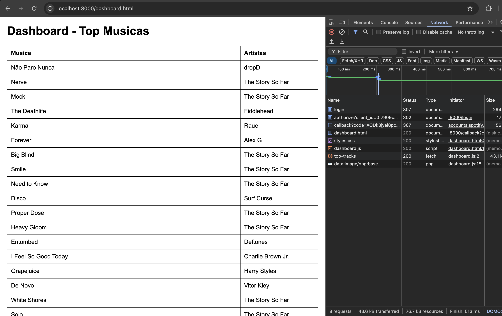
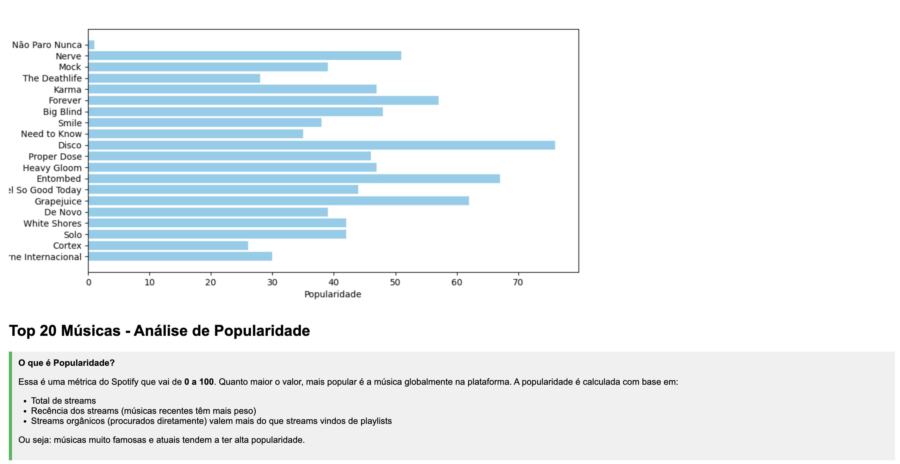

# Spotify-dashboard-top-music-analysis

This is a project that uses the **Spotify** API to create an interactive dashboard where users can view their most listened to songs and analyze characteristics of these songs

## Architecture diagram

## Prerequisites
- Python 3.7+ 
- Git
- Account on Spotify and Spotify for Developers

## Running locally
Follow the steps below to test the application locally and with your Spotify profile

### Spotify for Developers
1. Create an App on [Spotify for Developers](https://developer.spotify.com/dashboard)
2. Input your custom app name and app description
3. Redirect URIs use '''http://localhost:8000/callback'''
4. In API section, select **Web API** and click Save
5. Collect the Client ID and Client secret

### Backend

1. Clone the repository to your computer:

    ```bash
    git clone https://github.com/henriquelsz/Spotify-dashboard-top-music-analysis.git
    cd Spotify-Dashboard-top-music-analysis
    ```

2. Create a virtual environment:

    ```bash
    cd backend
    python3 -m venv venv
    ```

3. Activate the virtual environment:

    - On Windows:

        ```bash
        .\venv\Scripts\activate
        ```

    - On Linux/MacOS:

        ```bash
        source venv/bin/activate
        ```

4. Install dependencies:

    ```bash
    pip3 install -r requirements.txt
    ```

5. Create the `.env` file and add your Spotify App credentials that you created earlier:
    ```bash
    touch .env
    ```

    ```bash
    SPOTIPY_CLIENT_ID=your_client_id
    SPOTIPY_CLIENT_SECRET=your_client_secret
    SPOTIPY_REDIRECT_URI=http://localhost:8000/callback
    ```

6. Init the backend:

    ```bash
    uvicorn main:app --reload
    ```

### Frontend
If you have made any modifications to the frontend or want to run it locally, make sure **JavaScript** is configured correctly to make requests to the backend.

    ```bash
    cd..
    cd frontend
    python3 -m http.server 3000
    ```
---

## Testing
You can access the dashboard by typing **http://localhost:3000/index.html** in your browser

- When accessing the **/dashboard** route, a table will be displayed with the user's 20 most listened to songs.

## Results




## Contribution

If you want to contribute to this project, follow the steps below:

1. Fork this repository.
2. Create a new branch (`git checkout -b feature/newfeature`).
3. Make your changes and commit (`git commit -am 'Adding a new feature'`).
4. Push to the remote repository (`git push origin feature/newfeature`).
5. Open a Pull Request.

## Author

**Henrique Souza**